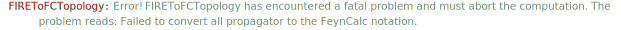

## FIREToFCTopology

`FIREToFCTopology[props, lmoms, emoms]` converts the list of FIRE propagators `props` that depend on the loop momenta `lmoms` and external momenta `emoms` into a proper `FCTopology` object.

Use the option `Names` to specify the `id` of the resulting topology.

### See also

[Overview](Extra/FeynHelpers.md), [FIRECreateConfigFile](FIRECreateConfigFile.md), [FIREPrepareStartFile](FIREPrepareStartFile.md).

### Examples

```mathematica
props1 = {p1^2, p2^2, p3^2, (Q - p1 - p2 - p3)^2, (Q - p1 - p2)^2, (Q - p1)^2, (Q - p2)^2, (p1 + p3)^2, (p2 + p3)^2}
```

$$\left\{\text{p1}^2,\text{p2}^2,\text{p3}^2,(-\text{p1}-\text{p2}-\text{p3}+Q)^2,(-\text{p1}-\text{p2}+Q)^2,(Q-\text{p1})^2,(Q-\text{p2})^2,(\text{p1}+\text{p3})^2,(\text{p2}+\text{p3})^2\right\}$$

```mathematica
FIREToFCTopology[props1, {p1, p2, p3}, {Q}]
```

$$\text{FCTopology}\left(\text{fctopology},\left\{\frac{1}{(\text{p1}^2+i \eta )},\frac{1}{(\text{p2}^2+i \eta )},\frac{1}{(\text{p3}^2+i \eta )},\frac{1}{((-\text{p1}-\text{p2}-\text{p3}+Q)^2+i \eta )},\frac{1}{((-\text{p1}-\text{p2}+Q)^2+i \eta )},\frac{1}{((Q-\text{p1})^2+i \eta )},\frac{1}{((Q-\text{p2})^2+i \eta )},\frac{1}{((\text{p1}+\text{p3})^2+i \eta )},\frac{1}{((\text{p2}+\text{p3})^2+i \eta )}\right\},\{\text{p1},\text{p2},\text{p3}\},\{Q\},\{\},\{\}\right)$$

By default the function assumes the standard $i \eta$-prescription as in $1/(p^2 -m^2 + i \eta)$. However, if you are using "reversed" propagators that are often preferred in FIRE and FIESTA, then what you have is $1/(- p^2 + m^2 - i \eta)$, although the propagator is still Minkowskian. In this case you should use the option `EtaSign` and set it to `-1`

```mathematica
props2 = {-p1^2 + m^2, -p2^2 + m^2, -p3^2 + m^2, -(-Q + p1 + p2 + p3)^2, -(p1 + p2 - Q)^2, -(p1 - Q)^2, -(p2 - Q)^2, -(p1 + p3)^2, -(p2 + p3)^2}
```

$$\left\{m^2-\text{p1}^2,m^2-\text{p2}^2,m^2-\text{p3}^2,-(\text{p1}+\text{p2}+\text{p3}-Q)^2,-(\text{p1}+\text{p2}-Q)^2,-(\text{p1}-Q)^2,-(\text{p2}-Q)^2,-(\text{p1}+\text{p3})^2,-(\text{p2}+\text{p3})^2\right\}$$

```mathematica
FIREToFCTopology[props2, {p1, p2, p3}, {Q}, EtaSign -> -1, Names -> myTopo]
```

$$\text{FCTopology}\left(\text{myTopo},\left\{\frac{1}{(-\text{p1}^2+m^2-i \eta )},\frac{1}{(-\text{p2}^2+m^2-i \eta )},\frac{1}{(-\text{p3}^2+m^2-i \eta )},\frac{1}{(-(\text{p1}+\text{p2}+\text{p3}-Q)^2-i \eta )},\frac{1}{(-(\text{p1}+\text{p2}-Q)^2-i \eta )},\frac{1}{(-(\text{p1}-Q)^2-i \eta )},\frac{1}{(-(\text{p2}-Q)^2-i \eta )},\frac{1}{(-(\text{p1}+\text{p3})^2-i \eta )},\frac{1}{(-(\text{p2}+\text{p3})^2-i \eta )}\right\},\{\text{p1},\text{p2},\text{p3}\},\{Q\},\{\},\{\}\right)$$

Notice that the polynomials in the FIRE propagators should not be expanded. Otherwise, there is a high chance that the conversion will fail.

```mathematica
FIREToFCTopology[ExpandAll[props1], {p1, p2, p3}, {Q}]
```



$$\text{\$Aborted}$$