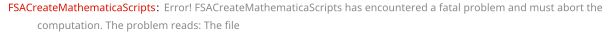

## FSACreateMathematicaScripts

`FSACreateMathematicaScripts[int, topo, path]` creates a Mathematica script  needed for the evaluation of the integral `int` (in the `GLI` representation) belonging to the topology `topo`. The files are saved to the directory `path/topoNameXindices`. The function returns a list of two strings that point to the script for FIESTA and the output file.

One can also use the `FeynAmpDenominator`-representation as in `FSACreateMathematicaScripts[fadInt, lmoms, path]`, where `lmoms` is the list of the loop momenta on which `fadInt` depends. In this case the FIESTA script will directly go into `path`.

Another way to invoke the function would be `FSACreateMathematicaScripts[{int1, int2, ...}, {topo1, topo2, ...}, path]` in which case the files will be saved to `path/topoName1Xindices1`, `path/topoName2Xindices2` etc. The syntax `FSACreateMathematicaScripts[{int1, int2, ...}, {topo1, topo2, ...}, {path1, path2, ...}]` is also possible.

Unless you are computing a single scale integral with the scale variable set to unity, you must specify all external parameters (e.g. masses and scalar products of external momenta) and their numerical values via the option `FSAParameterRules`.  The option `FinalSubstitutions` can be used to assign some kinematic parameters (e.g. scalar products or masses) particular symbolic values.

Another important option that you most likely would like to specify is `FSAOrderInEps` which specifies the order in $\varepsilon$ up to which the integral should be evaluated.

The names of the FIESTA script can be changed via the option `FSAScriptFileName with the default value being `FIESTAScript.m`.

The integrator used for the numerical evaluation of the integral is set by the option `FSAIntegrator`, where `"quasiMonteCarlo"` is the default value. Accordingly, if you want to increase the number of iterations, you should use the option `FSAIntegratorOptions`.

If you know in advance that the integral you are computing does not have cuts (i.e. the result is purely real with no imaginary part), then it is highly recommended to disable the contour deformation. This will give you a huge performance boost. The option controlling this FIESTA parameter is called `FSAComplexMode` and is set to `True` by default.

The prefactor of integrals evaluated by pySecDec is given by  $\frac{1}{i \pi^{D/2}} e^{\gamma_E \frac{4-D}{2}}$ per loop, which is the standard choice for multiloop calculations. An extra prefactor can be added using the option `FSAAdditionalPrefactor.

If you want to compute an integral using asymptotic expansion, you need to set the option `FSASDExpandAsy` to `True` and specify the expansion order via `FSASDExpandAsyOrder`. Furthermore, the expansion parameter must be made known using `FSAExpandVar`.

### See also

[Overview](Extra/FeynHelpers.md), [FSAOrderInEps](FSAOrderInEps.md), [FSAIntegrator](FSAIntegrator.md), [FSAComplexMode](FSAComplexMode.md), [FSASDExpandAsy](FSASDExpandAsy.md), [FSASDExpandAsyOrder](FSASDExpandAsyOrder.md), [FSAExpandVar](FSAExpandVar.md).

### Examples

```mathematica
topo1 = FCTopology[prop1L, {-SFAD[{{I p1, 0}, {-m1^2, -1}, 1}], -SFAD[{{I (p1 + q), 0}, {-m2^2, -1}, 1}]}, {p1}, {q}, {}, {}]
int1 = GLI[prop1L, {1, 1}]
```

$$\text{FCTopology}\left(\text{prop1L},\left\{-\frac{1}{(-\text{p1}^2+\text{m1}^2-i \eta )},-\frac{1}{(-(\text{p1}+q)^2+\text{m2}^2-i \eta )}\right\},\{\text{p1}\},\{q\},\{\},\{\}\right)$$

$$G^{\text{prop1L}}(1,1)$$

```mathematica
fileNames = FSACreateMathematicaScripts[int1, topo1, FileNameJoin[{$FeynCalcDirectory, "Database"}], 
    FinalSubstitutions -> {SPD[q] -> qq, qq -> 20. , m1 -> 2. , m2 -> 2.}];
```



$$\text{\$Aborted}$$

```mathematica
fileNames[[1]] // FilePrint[#, 1 ;; 20] &
```


$$\text{FilePrint}[\text{fileNames}[[1]],1\text{;;}20]$$

```mathematica
SFAD[{I p, {-m^2, -1}}]
```

$$\frac{1}{(-p^2+m^2-i \eta )}$$

```mathematica
fileNames = FSACreateMathematicaScripts[SFAD[{I p, {-m^2, -1}}], {p}, FileNameJoin[{$FeynCalcDirectory, "Database", "tal1LInt"}], 
    FinalSubstitutions -> {m -> 1.}];
```


$$\text{\$Aborted}$$

```mathematica
fileNames[[1]] // FilePrint[#, 1 ;; 20] &
```


$$\text{FilePrint}[\text{fileNames}[[1]],1\text{;;}20]$$

```mathematica
FSACreateMathematicaScripts[GLI[asyR2prop2Ltopo01013X11111N1, {1, 1, 1, 1, 1}], 
   FCTopology[asyR2prop2Ltopo01013X11111N1, {SFAD[{{(-I)*p3, 0}, {0, -1}, 1}], SFAD[{{(-I)*p1, 0}, {0, -1}, 1}], 
     SFAD[{{(-I)*(p3 + q), 0}, {-mb^2, -1}, 1}], SFAD[{{(-I)*(p1 + q), 0}, {-mb^2, -1}, 1}], 
     GFAD[{{SPD[p1, -p1 + 2*p3] - SPD[p3, p3], -1}, 1}]}, {p1, p3}, {q}, {SPD[q, q] -> mb^2}, {}], 
   FileNameJoin[{$FeynCalcDirectory, "Database"}], 
   FSAParameterRules -> {mb -> 1}, FSAOrderInEps -> 2];
```


$$\text{\$Aborted}$$