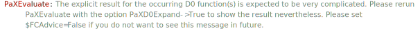

## PaXD0Expand

`PaXD0Expand` is an option for `PaXEvaluate`. If set to `True`, Package-X function `D0Expand` will be applied to the output of Package-X.

### See also

[Overview](Extra/FeynHelpers.md), [PaXEvaluate](PaXEvaluate.md).

### Examples

```mathematica
D0[0, 0, 0, 0, s, t, m^2, m^2, m^2, m^2]
PaXEvaluate[%]
```

$$\text{D}_0\left(0,0,0,0,s,t,m^2,m^2,m^2,m^2\right)$$



$$\text{D}_0\left(0,0,0,0,s,t,m^2,m^2,m^2,m^2\right)$$

The full result is a `ConditionalExpression`

```mathematica
D0[0, 0, 0, 0, s, t, m^2, m^2, m^2, m^2]
res = PaXEvaluate[%, PaXC0Expand -> True];
```

$$\text{D}_0\left(0,0,0,0,s,t,m^2,m^2,m^2,m^2\right)$$


```mathematica
res // Short
res // Last
```

$$\text{D}_0\left(0,0,0,0,s,t,m^2,m^2,m^2,m^2\right)$$

$$m^2$$

Use `Normal` to get the actual expression

```mathematica
(res // Normal)
```

$$\text{D}_0\left(0,0,0,0,s,t,m^2,m^2,m^2,m^2\right)$$